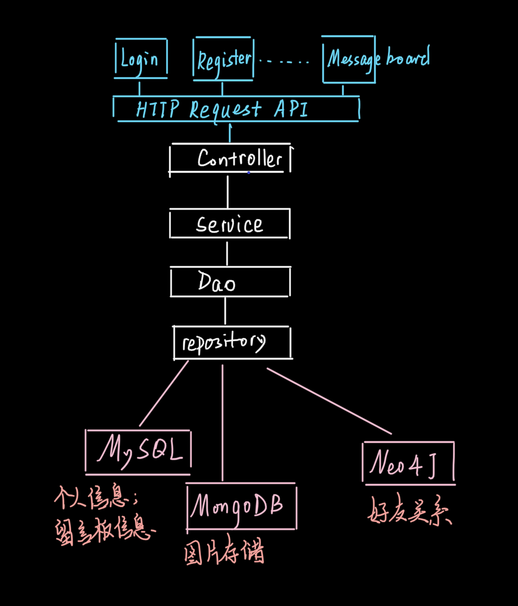

# Backend for Course Design on Application Software, 2021 spring

## 数据库设计讨论

#### 数据库主要实体类型
1. 用户(User)，以下为用户实体具有的属性，括号内为json文件中对应的属性名
    - ID(id,pk)
    - 用户名(username)
    - 用户密码(password)
    - 用户邮箱(email)   // Todo
    - 留言(List<Message> mappedBy = "author", @OneToMany, CascadeType.ALL)  // Todo
1. 留言(Message)
    - ID(id,pk)
    - 留言用户(author, User, @ManyToOne({CascadeType.REFRESH, CascadeType.MERGE}, optional = false), @JoinColumn(name="user_id))
    - 留言内容(content)
    - 日期(date, Date)
1. 图片(Picture)
    - ID(id, pk)
    - 图片名(picname)
    - 图片地址(picaddr， 使用图云存储地址)

## 后端功能需求分析

#### 用户管理（用户名和邮箱均唯一，且不能修改）
- 用户注册：接收注册请求->查看是否存在相同用户名或者相同的邮箱地址
    ->不存在->添加到数据库中->注册成功
    ->存在->注册失败
- 用户登录：接收登录请求->匹配用户名/密码
    ->匹配成功->登录成功
    ->匹配失败->登录失败
- 用户密码修改：接收用户密码修改请求->校验原密码
    ->第一次输入新密码->第二次输入新密码
    ->两次一致->修改数据库中密码->修改成功
    ->两次不一致->修改失败

#### 留言板管理
- 发布留言：接收前端数据(POST,用户，留言内容，日期)->创建新留言->添加到数据库中 // Todo: 留言中添加图片
- 删除留言：接收前端数据(DELETE, id)->删除数据库中对应留言
- 修改留言：接收前端数据(PUT, 留言内容，日期)->修改数据库中留言
- 查看全部留言
- 查看自己的留言
- 评论留言 // Todo

# 项目整体框架讨论

# 注意事项
- 目前并没有设置错误情况处理，目前认为查询的用户及留言均存在；后续会在与前端进行对接的过程中及进行修改